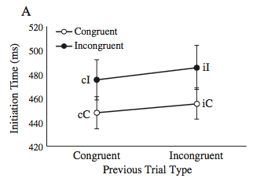
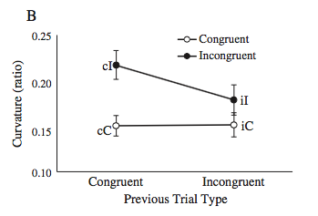

#### Article ID: LcquD
#### Pilot: Erica Yoon
#### Co-pilot: Tom Hardwicke  
#### Start date: 4/18/2017
#### End date: 4/19/2017  

-------

#### Methods summary: 
Participants were asked to indicate what was the color of text shown on screen by touching one of three response locations (green, red or blue). Trials could be congruent (i.e. the text word and the text color are the same) or incongruent.

------

#### Target outcomes: 

> 2.2. Results

> All trials featuring a repeat of the target (i.e., text color) or distractor (i.e., word) presented on the previous trial were excluded from analysis, as was the first trial of each block. Only accurate responses following an accurate response were included in the following analyses, except for the measure of error rate, which included inaccurate responses. Removing errors and trials preceded by an error resulted in the additional exclusion of 7.0% of the remaining valid trials (SD = 5.7%) per participant on average. Performance was analyzed with a series of 2 (current trial congruency: C vs. I) × 2 (previous trial congruency: c vs. i) ANOVAs.

> 2.2.1. Initiation time

> As predicted, initiation times conformed to the pattern of effects proposed to underlie the response threshold adjustment process (cC < iC < cI < iI; see Fig. 2A). Initiation times revealed a main effect of current trial congruency, with higher initiation times on incongruent relative to congruent trials, F(1, 23) = 18.95, p < 0.001, ηp2 = 0.45, and a significant main effect of previous trial congruency, F(1, 23) = 5.95, p = 0.023, ηp2 = 0.21, with higher initiation times on trials preceded by an incongruent relative to a congruent trial. No interaction between current and previous trial congruency was observed, F(1, 23) = 0.183, p = 0.67.

> 2.2.2. Reach curvature

> Consistent with our second prediction, reach curvatures conformed to the pattern of effects previously linked to the monitoring component of cognitive control in the Stroop task (cC = iC < iI < cI; see Fig. 2B). Reach curvatures revealed a main effect of current trial congruency, with larger reach curvatures on incongruent relative to congruent trials, F(1, 23) = 19.05, p < 0.001, ηp2 = 0.45. A significant main effect of previous trial congruency was also observed, F(1, 23) = 5.33, p = 0.03, ηp2 = 0.19, with larger curvatures on trials preceded by a congruent relative to an incongruent trial. Further, a significant interaction between previous and current trial congruency was observed, F(1, 23) = 6.98, p = 0.015, ηp2 = 0.23. Follow-up tests revealed larger reach curvatures on cI than iI trials, F(1, 23) = 8.48, p = 0.008, ηp2 = 0.27. No effect of previous trial type was found on congruent trials, F(1, 23) = 0.009, p = 0.92. Further, reach curvatures were significantly larger on iI than iC trials, F(1, 23) = 5.60, p = 0.027, ηp2 = 0.20.

------

```{r global_options, include=FALSE}
knitr::opts_chunk$set(echo=TRUE, warning=FALSE, message=FALSE)
```

## Step 1: Load packages

```{r}
library(tidyverse) # for data munging
library(knitr) # for kable table formating
library(haven) # import and export 'SPSS', 'Stata' and 'SAS' Files
library(readxl) # import excel files
library(CODreports) # custom report functions
library(foreign)
```

## Step 2: Load data

```{r}
d1 = read.spss("data/Exp 1 - ACC Preceded by ACC Trial - Stimulus and Response Repeats Excluded.sav", to.data.frame=TRUE)
d2 = read.spss("data/Exp 1 - ACC Preceded by ACC Trial - Stimulus and Response Repeats Included.sav", to.data.frame=TRUE)
d3 = read.spss("data/Exp 1 - Errors Included - Stimulus and Response Repeats Excluded.sav", to.data.frame=TRUE)
d4 = read.spss("data/Exp 1 - Errors Included - Stimulus and Response Repeats Included.sav", to.data.frame=TRUE)
```

## Step 3: Tidy data

```{r}
# keep only subjects that are meant to be included in analysis
d1 <- d1 %>%
  filter(Include == "1")
d2 <- d2 %>%
  filter(Include == "1")
d3 <- d3 %>%
  filter(Include == "1")
d4 <- d4 %>%
  filter(Include == "1")
```

## Step 4: Run analysis

### Pre-processing

```{r}
# data frame for initiation time
IT <- d1 %>%
  select(SubNum, contains("IT")) %>%
  mutate(SubNum = as.factor(SubNum)) %>%
  gather(trial_type, mean, IT.cC_mean:IT.iI_mean) %>%
  mutate(prev_trial_type = substr(trial_type, 4, 4),
         curr_trial_type = substr(trial_type, 5, 5))

# data frame for reach curvature
RC <- d1 %>%
  select(SubNum, contains("CURV")) %>%
  mutate(SubNum = as.factor(SubNum)) %>%
  gather(trial_type, mean, CURV.cC_mean:CURV.iI_mean) %>%
  mutate(prev_trial_type = substr(trial_type, 6, 6),
         curr_trial_type = substr(trial_type, 7, 7))
```

### Descriptive statistics


> As predicted, initiation times conformed to the pattern of effects proposed to underlie the response threshold adjustment process (cC < iC < cI < iI; see Fig. 2A).

```{r}
# means for initiation time
IT %>%
  group_by(prev_trial_type, curr_trial_type) %>%
  summarize(se = 1000*(sd(mean)/sqrt(length(mean))),
            initiation_time_mean = 1000*mean(mean)
            ) %>%
  mutate(trial_type = paste(prev_trial_type, curr_trial_type, sep="")) %>%
ggplot(aes(x=prev_trial_type, y=initiation_time_mean, group=curr_trial_type, color=curr_trial_type)) +
  geom_line() +
  ylim(420, 520) +
    geom_errorbar(aes(ymin=initiation_time_mean-se,ymax=initiation_time_mean+se,width=.1)) +
  geom_text(aes(label=trial_type),hjust=2, vjust=2) +
  guides(color=FALSE) +
  xlab("Previous Trial Type") +
  ylab("Initiation Time (ms)") +
  theme_bw()
```



> Consistent with our second prediction, reach curvatures conformed to the pattern of effects previously linked to the monitoring component of cognitive control in the Stroop task (cC = iC < iI < cI; see Fig. 2B). 

```{r}
# means for reach curvature
RC %>%
  group_by(prev_trial_type, curr_trial_type) %>%
  summarize(se = sd(mean)/sqrt(length(mean)),
            reach_curvature_mean = mean(mean)
            ) %>%
  mutate(trial_type = paste(prev_trial_type, curr_trial_type, sep="")) %>%
ggplot(aes(x=prev_trial_type, y=reach_curvature_mean, group=curr_trial_type, color=curr_trial_type)) +
  geom_line() +
  ylim(0.10, 0.25) +
    geom_errorbar(aes(ymin=reach_curvature_mean-se,ymax=reach_curvature_mean+se,width=.1)) +
  geom_text(aes(label=trial_type),hjust=2, vjust=2) +
  guides(color=FALSE) +
  xlab("Previous Trial Type") +
  ylab("Curvature (ratio)") +
  theme_bw()  
```





### Inferential statistics

> Initiation times revealed a main effect of current trial congruency, with higher initiation times on incongruent relative to congruent trials, F(1, 23) = 18.95, p < 0.001, ηp2 = 0.45, and a significant main effect of previous trial congruency, F(1, 23) = 5.95, p = 0.023, ηp2 = 0.21, with higher initiation times on trials preceded by an incongruent relative to a congruent trial. No interaction between current and previous trial congruency was observed, F(1, 23) = 0.183, p = 0.67.

```{r}
# anova for initiation time
fit <- aov(mean ~ curr_trial_type * prev_trial_type + Error(SubNum/(curr_trial_type * prev_trial_type)), data=IT)
summary(fit)
```

> Reach curvatures revealed a main effect of current trial congruency, with larger reach curvatures on incongruent relative to congruent trials, F(1, 23) = 19.05, p < 0.001, ηp2 = 0.45. A significant main effect of previous trial congruency was also observed, F(1, 23) = 5.33, p = 0.03, ηp2 = 0.19, with larger curvatures on trials preceded by a congruent relative to an incongruent trial. Further, a significant interaction between previous and current trial congruency was observed, F(1, 23) = 6.98, p = 0.015, ηp2 = 0.23. 

```{r}
# anova for reach curvature
fit <- aov(mean ~ curr_trial_type * prev_trial_type + Error(SubNum/(curr_trial_type * prev_trial_type)), data=RC)
summary(fit)
```

> Follow-up tests revealed larger reach curvatures on cI than iI trials, F(1, 23) = 8.48, p = 0.008, ηp2 = 0.27. 

```{r}
# anova comparing iI vs. cI trials
fit <- aov(mean ~ prev_trial_type + Error(SubNum/prev_trial_type), 
           data=filter(RC, curr_trial_type == "I"))
summary(fit)
```

> No effect of previous trial type was found on congruent trials, F(1, 23) = 0.009, p = 0.92. 

```{r}
# anova comparing iC vs. cC trials
fit <- aov(mean ~ prev_trial_type + Error(SubNum/prev_trial_type), 
           data=filter(RC, curr_trial_type == "C"))
summary(fit)
```

> Further, reach curvatures were significantly larger on iI than iC trials, F(1, 23) = 5.60, p = 0.027, ηp2 = 0.20.

```{r}
# anova comparing iC vs. iI trials
fit <- aov(mean ~ curr_trial_type + Error(SubNum/curr_trial_type), 
           data=filter(RC, prev_trial_type == "i"))
summary(fit)
```

INSUFFICIENT INFORMATION ERROR

The authors did not provide raw data (and instead provided averaged data for each participant and condition used in SPSS), and thus it was impossible to confirm the following:

> Removing errors and trials preceded by an error resulted in the additional exclusion of 7.0% of the remaining valid trials (SD = 5.7%) per participant on average.


## Step 5: Conclusion

```{r}
codReport(Report_Type = 'pilot',
          Article_ID = 'LcquD', 
          Insufficient_Information_Errors = 1,
          Decision_Errors = 0, 
          Major_Numerical_Errors = 0, 
          Minor_Numerical_Errors = 0)
```

There were no major or minor numerical errors. However, there was one insufficient information error due to the unavailibility of raw data. 

```{r session_info, include=TRUE, echo=TRUE, results='markup'}
devtools::session_info()
```
